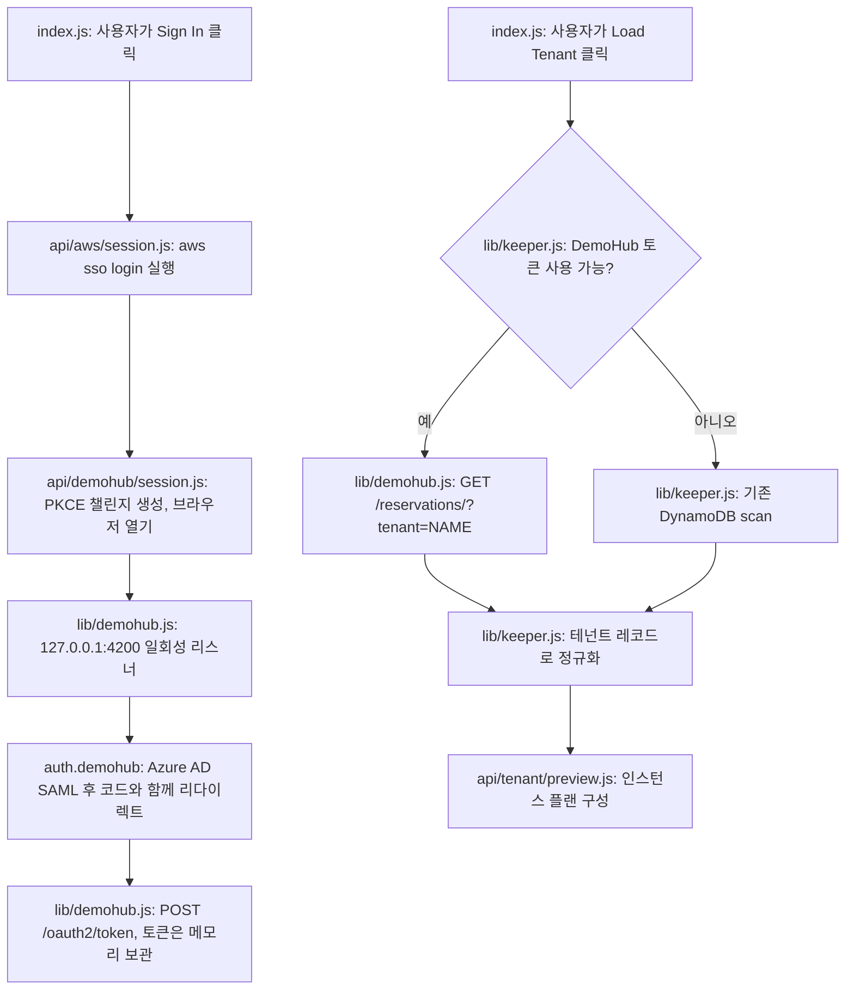

# DemoHub SSO 로그인과 단일 호출 테넌트 조회 — 구현 계획서

**상태:** 2026-09-08 구현 완료. 2단계에서 DynamoDB와 완전히 일치했고 조회는 몇 분에서 약 3초로
줄었다. 작성 이후 두 가지가 바뀌었다. 세션을 디스크에도 캐시하게 됐고(ADR-007이 ADR-003을 대체),
Preview 경로에는 뒤이어 AWS 클라이언트 재사용과 병렬화가 필요했다.

**목표:** Keeper UI에서 DemoHub에 로그인해 테넌트 이름을 HTTP 한 번으로 예약 정보에 매핑하고,
Load Tenant가 117MB짜리 `DemoHub-Reservations-prod` 테이블을 훑지 않게 한다. AWS SSO는 그대로
둔다. Secrets Manager, EC2, 프로비저닝 후 DynamoDB 쓰기에는 여전히 AWS 자격증명이 필요하다.

**아키텍처:** 기존 `api/aws/session.js`와 같은 모양의 로그인 라우트 하나, DemoHub의 OAuth2/PKCE
처리와 API 호출을 담을 라이브러리 하나, 그리고 기존 `queryTenant()` 안의 분기 하나. DynamoDB
스키마 변경도, DemoHub 백엔드 변경도, 새 npm 의존성도 없다.

**기술 스택:** Next.js API 라우트, Node 표준 라이브러리(PKCE는 `node:crypto`, 루프백 리스너는
`node:http`, 브라우저 실행은 `child_process`), 이미 설치된 `axios`, 기존 AWS SDK 클라이언트.

---

## 배경: 왜 필요한가

`queryTenant()`는 지금 `DemoHub-Reservations-prod`를 `Scan`으로 페이지 순회한다. 23,883건,
117MB다. 그리고 **전부 받은 다음에야** `name`으로 찾는다. 테이블의 유일한 키가 `GUID`이고
`name` 인덱스가 없기 때문이다. 동일한 Scan을 따로 돌려봤을 때 5분 안에 끝나지 않았다. DynamoDB
로는 더 나아질 수 없다. `Query`는 키에 대한 등호 조건이 필수이고, `FilterExpression`은 읽은
**뒤에** 적용되므로 전송량만 줄일 뿐 작업량은 그대로다.

`name` GSI를 만들면 제대로 해결되고 실제로 SSO 역할에 `dynamodb:UpdateTable` 권한도 있지만,
이 테이블은 DemoHub 팀 소유이고 그 방안은 반려되었다.

DemoHub 백엔드는 바로 이 질문에 답해준다. ServiceNow 프로젝트의 `demohub_client.py`가
`GET /reservations/?tenant=<name>&status=...`를 호출해 서버사이드로 이름을 필터하고, 호출부는 그
리스트 응답에서 `instanceStack`을 바로 읽는다. Keeper가 필요로 하는 `name`, `GUID`,
`instanceStack` 세 가지와 정확히 일치한다.

## 계획 작성 전 확인한 사실

| 확인 항목 | 결과 |
|---|---|
| 인증 없이 `GET /reservations/` | HTTP 401 — 엔드포인트 정상, 인증 필요 |
| Cognito 앱 클라이언트 `DemoHub-WebUIClient` | 시크릿 없음 — 로컬 앱에서 PKCE 가능 |
| 등록된 콜백 | `http://localhost:4200/` 포함 |
| `authorize`에 `redirect_uri=http://localhost:4200/` | Azure AD SAML로 302 |
| 등록되지 않은 포트로 `authorize` | `error=redirect_mismatch`로 302 |
| 폼 바디로 `POST /oauth2/token` | HTTP 400(`invalid_grant`) — 시크릿 없는 교환 허용 |
| Refresh 토큰 수명 | 30일 |

`demohub_client.py`가 코드 교환을 직접 구현하지 말라고 경고한 것은 DemoHub SPA가 이미 소비한
코드를 재사용하는 경우다. 루프백으로 **우리 코드를 처음부터 직접 받으면** 그 상황 자체가 생기지
않는다.

## 하지 않을 것

- AWS 인증 대체. 여전히 필요하며 변경하지 않는다.
- 두 시스템의 자격증명 통합. AWS는 SigV4 키, DemoHub는 Cognito JWT를 요구하므로 하나의 토큰으로
  둘 다 만족시킬 수 없다. 다만 두 플로우 모두 같은 Azure AD로 페더레이션되므로 브라우저 세션이
  공유되어 두 번째 로그인은 대개 무음으로 통과한다.
- DynamoDB, DemoHub 백엔드, HAR Inspector 변경.
- DemoHub를 통한 쓰기. KCM 플래그는 계속 AWS SDK로 쓴다.

---

## 동작 흐름

---

## 변경 대상

| 파일 | 변경 내용 |
|---|---|
| `web/lib/demohub.js` (신규) | PKCE 헬퍼, authorize URL, 루프백 리스너, 토큰 교환/갱신, 메모리 토큰 저장소, `findReservation(tenantName)` |
| `web/pages/api/demohub/session.js` (신규) | `GET`은 로그인 상태와 만료 시각, `POST`는 로그인 수행. AWS 라우트처럼 `ensureAuthToken()`으로 보호 |
| `web/lib/keeper.js` | `queryTenant()`에 분기 하나 추가. 토큰이 있으면 DemoHub, 없으면 현재 scan. 그 외 변경 없음 |
| `web/pages/index.js` | Step 2에 상태 pill과 버튼 추가. 기존 버튼은 "Sign In"이 되어 AWS → DemoHub 순으로 실행 |
| `web/scripts/check-demohub-lookup.js` (신규) | 실행 가능한 검증 스크립트 1개 (아래 참조) |
| `README.md`, `CHANGELOG.md` | 각 한 줄 |

### 로그인 순서

1. `POST /api/demohub/session`이 `code_verifier`(무작위 32바이트 base64url)와 `S256`
   `code_challenge`, 그리고 무작위 `state`를 만든다.
2. 일회성 `http` 서버가 `127.0.0.1:4200`에 바인딩한다. 포트가 사용 중이면 멈춰 있지 않고 포트
   번호를 명시한 오류로 즉시 실패한다.
3. `https://auth.demohub.sailpointtechnologies.com/oauth2/authorize`를 브라우저로 연다.
   `client_id=1423krarthjon466io5g1ofkqu`, `response_type=code`,
   `scope=openid email profile`, `redirect_uri=http://localhost:4200/`, 챌린지 포함.
4. Azure AD가 `?code=&state=`로 리스너에 돌아온다. 코드를 쓰기 **전에** `state`를 비교하고,
   불일치면 중단한다.
5. `grant_type=authorization_code`와 verifier로 `POST /oauth2/token`을 호출해 `id_token`,
   `access_token`, `refresh_token`을 받는다.
6. 이번 버전은 토큰을 **메모리에만** 둔다. 서버를 재시작하면 클릭 한 번이 들지만 Azure AD 세션이
   남아 있어 보통 무음이다. 30일짜리 refresh 토큰을 디스크에 저장하는 것은 의도적으로 미룬다.
   나중에 추가한다면 권한 0600과 gitignore 등록이 함께 필요하다.

### 조회 순서

`findReservation(name)`은 `GET /reservations/?tenant=<name>&status=PROVISIONED`를
`Authorization: Bearer <id_token>`, `custom:group` 클레임에서 뽑은 `role` 헤더(우선순위는
`SSO - DemoHub - Admins`), 그리고 `Origin`/`Referer`를
`https://demohub.sailpointtechnologies.com`로 설정해 호출한다. 뒤 두 헤더가 없으면 일부
엔드포인트가 403을 낸다고 `demohub_client.py`에 기록되어 있다. 서버 필터가 느슨할 수 있으므로
`request_deprovision()`이 하듯 결과에서 `name` 완전 일치만 취한다. 401이면 조용히 한 번
갱신하고, 그래도 실패하면 재로그인을 안내한다.

### 필드 매핑

DynamoDB 항목과 API 응답이 같다고 **가정하지 않는다.** Keeper에 필요한 것은 `name`, `GUID`,
`instanceStack`이고, API는 `name`, `GUID`, `instanceStack`과 `status`(DynamoDB의
`provisioningStatus`에 대응)를 노출하는 것으로 보인다. 정확한 매핑은 코드를 붙이기 **전에**
아래 2단계에서 확인한다. 정규화는 함수 하나에 모아 앱의 나머지가 기존 형태를 그대로 보게 한다.

---

## 검증

**2단계 — 읽기 전용 실측.** 로그인 후 알려진 테넌트를 API와 `GetItem`(GUID)으로 각각 가져와
비교한다. GUID가 같은지, 인스턴스 id 집합이 같은지, 인스턴스별
`imageId`/`publicIp`/`displayName`/`state`가 같은지 확인하고 지연 시간을 기록한다. 이것이 필드
매핑의 관문이다. 미리보기에 필요한 값이 API에 없다면 여기서 멈추고 계획서를 수정한다.

**3단계 — 드라이런.** DemoHub 세션이 있는 상태로 UI에서 Load Tenant를 실행하고, DemoHub
로그아웃 후 scan 경로로 같은 테넌트를 불러 렌더된 인스턴스 플랜을 비교한다. 두 결과가 동일해야
한다.

**4단계 — 전체 실행.** 의도적으로 Load Tenant까지만 한다. 프로비저닝은 이번 변경 범위가 아니므로
검증으로 재실행하지 않는다.

**실행 가능한 체크.** `web/scripts/check-demohub-lookup.js`, 네트워크 없이 assert 기반으로
동작한다. 알려진 verifier/challenge 쌍으로 PKCE 계산이 맞는지, `state` 불일치가 거부되는지,
완전 일치 필터가 유사 이름을 버리는지(`company231`이 `company23118-poc`에 매칭되면 안 됨),
정규화 함수가 API 형태를 `buildInstancesPlan()`이 읽는 필드로 옮기는지를 검사한다.

---

## 위험 요소

`http://localhost:4200/`은 원래 DemoHub의 Angular 개발 서버용으로 등록된 콜백이지 우리 것이
아니다. 저쪽에서 제거하면 로그인이 깨진다. 폴백이 있어 앱은 계속 동작하고, 실패 메시지에
`redirect_mismatch`를 그대로 노출한다. 저쪽 설정을 바꾸지는 않지만, 그들의 SPA `client_id`를
다른 로컬 도구에서 재사용한다는 사실은 DemoHub 팀에 알려두는 편이 좋다.

API에 버전이 없으므로 필드명이 바뀌면 미리보기 회귀로 나타난다. 정규화 함수와 오프라인 체크가
그 수정을 한 줄로 만들어 준다.

로그인 중에는 4200 포트가 비어 있어야 한다.

## 롤백

버튼과 라우트를 제거하면 된다. `queryTenant()`의 폴백은 현재 코드 경로 그대로이며 삭제하지
않으므로, AWS SSO만으로도 앱은 계속 동작한다.
