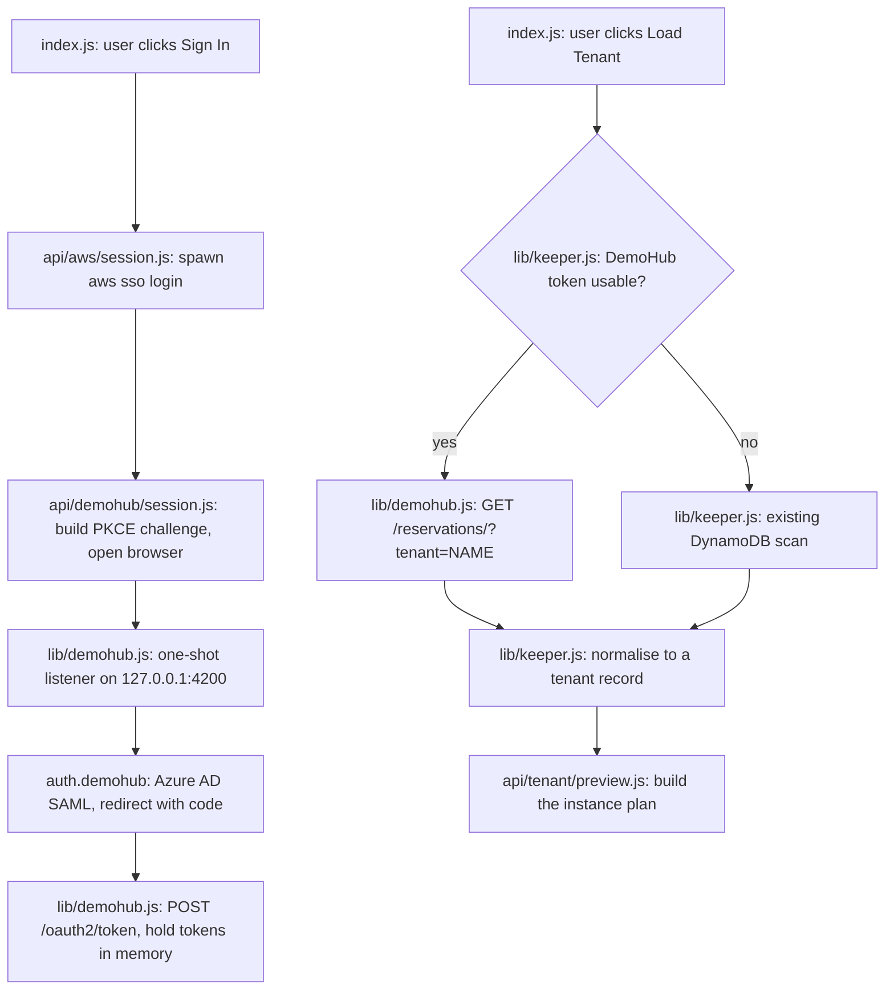

# DemoHub SSO Sign-in and One-Call Tenant Lookup — Implementation Plan

**Status:** Implemented 2026-09-08. Stage 2 matched DynamoDB exactly and the lookup dropped
from minutes to about 3 seconds. Two things changed after this was written: the session is
also cached on disk (ADR-007 supersedes ADR-003), and the preview route needed the AWS client
reuse and fan-out that followed.

**Goal:** Resolve a tenant name to its reservation in a single HTTP call by signing in to
DemoHub from the Keeper UI, so Load Tenant stops walking the 117 MB
`DemoHub-Reservations-prod` table. AWS SSO stays exactly as it is, because Secrets Manager,
EC2 and the post-provision DynamoDB write still need AWS credentials.

**Architecture:** One new sign-in route that mirrors the existing `api/aws/session.js`, one
new library for the DemoHub OAuth2/PKCE dance and its API calls, and a single branch inside
the existing `queryTenant()` that prefers DemoHub and falls back to today's scan. No
DynamoDB schema change, no DemoHub backend change, no new npm dependency.

**Tech Stack:** Next.js API routes, Node standard library (`node:crypto` for PKCE,
`node:http` for the loopback listener, `child_process` to open the browser), `axios`
(already a dependency), the existing AWS SDK clients.

---

## Background: why this is worth doing

`queryTenant()` currently pages a `Scan` of `DemoHub-Reservations-prod` — 23,883 items,
117 MB — and only then matches on `name`, because the table's only key is `GUID` and no
index exists on `name`. A standalone run of that same scan did not finish within five
minutes. DynamoDB cannot do better without an index: `Query` requires an equality condition
on a key, and `FilterExpression` is applied *after* the read, so it reduces payload but not
work.

Adding a `name` GSI would fix it properly, and the SSO role does have `dynamodb:UpdateTable`,
but the table belongs to the DemoHub team and that route was declined.

DemoHub's own backend already answers this exact question. `demohub_client.py` in the
ServiceNow project calls `GET /reservations/?tenant=<name>&status=...`, which filters by
tenant name server-side, and its callers read `instanceStack` straight off the list
response — the same three fields Keeper needs (`name`, `GUID`, `instanceStack`).

## What was verified before writing this plan

| Check | Result |
|---|---|
| `GET /reservations/` without auth | HTTP 401 — endpoint is live, auth required |
| Cognito app client `DemoHub-WebUIClient` | No client secret — PKCE from a local app is possible |
| Registered callbacks | Includes `http://localhost:4200/` |
| `authorize` with `redirect_uri=http://localhost:4200/` | 302 to Azure AD SAML |
| `authorize` with an unregistered port | 302 to `error=redirect_mismatch` |
| `POST /oauth2/token` with a form body | HTTP 400 (`invalid_grant`) — accepts secretless grants |
| Refresh token validity | 30 days |

The warning in `demohub_client.py` about not re-implementing the code exchange applies to
reusing a code already consumed by DemoHub's own SPA. Receiving our own code on a loopback
redirect avoids that situation entirely.

## Non-goals

- Replacing AWS authentication. It is still required and unchanged.
- One credential for both systems. AWS needs SigV4 keys, DemoHub needs a Cognito JWT; no
  single token can satisfy both. Both flows federate to the same Azure AD tenant, so the
  browser session is shared and the second sign-in is normally silent.
- Any change to DynamoDB, to the DemoHub backend, or to the HAR Inspector.
- Writing through DemoHub. Provisioning keeps writing the KCM flag via the AWS SDK.

---

## Operator flow

---

## Proposed changes

| File | Change |
|---|---|
| `web/lib/demohub.js` (new) | PKCE helpers, authorize URL, loopback listener, token exchange and refresh, in-memory token store, `findReservation(tenantName)` |
| `web/pages/api/demohub/session.js` (new) | `GET` returns sign-in status and expiry; `POST` runs the sign-in. Gated by `ensureAuthToken()` like the AWS route |
| `web/lib/keeper.js` | `queryTenant()` gains one branch: use DemoHub when a token is usable, otherwise the current scan. Nothing else changes |
| `web/pages/index.js` | Second status pill and button in the Step 2 row; the existing button becomes "Sign In" and runs AWS then DemoHub in sequence |
| `web/scripts/check-demohub-lookup.js` (new) | One runnable check (see Verification) |
| `README.md`, `CHANGELOG.md` | One line each |

### Sign-in sequence

1. `POST /api/demohub/session` generates `code_verifier` (32 random bytes, base64url) and
   `code_challenge` (`S256`), plus a random `state`.
2. A one-shot `http` server binds `127.0.0.1:4200`. If the port is busy the route fails
   immediately with a message naming the port, rather than hanging.
3. The browser is opened at
   `https://auth.demohub.sailpointtechnologies.com/oauth2/authorize` with
   `client_id=1423krarthjon466io5g1ofkqu`, `response_type=code`,
   `scope=openid email profile`, `redirect_uri=http://localhost:4200/`, and the challenge.
4. Azure AD returns to the listener with `?code=&state=`. The `state` is compared before the
   code is used; a mismatch aborts.
5. `POST /oauth2/token` with `grant_type=authorization_code` and the verifier returns
   `id_token`, `access_token`, `refresh_token`.
6. Tokens are held **in memory only** for this version. A server restart costs one click,
   which is normally silent because the Azure AD session persists. Writing the 30-day
   refresh token to disk is deliberately deferred; if it is added later it needs mode 0600
   and a gitignore entry.

### Lookup sequence

`findReservation(name)` sends `GET /reservations/?tenant=<name>&status=PROVISIONED` with
`Authorization: Bearer <id_token>`, the `role` header derived from the `custom:group` claim
(preferring `SSO - DemoHub - Admins`), and `Origin`/`Referer` set to
`https://demohub.sailpointtechnologies.com` — `demohub_client.py` records that several
endpoints return 403 without the last two. Results are filtered to an exact `name` match,
mirroring what `request_deprovision()` does, because the server-side filter may be fuzzy.
A 401 triggers one silent refresh, then one re-login prompt.

### Field mapping

The DynamoDB item and the API response are **not assumed to be identical**. Keeper needs
`name`, `GUID` and `instanceStack`; the API is known to expose `name`, `GUID`,
`instanceStack` and `status` (where DynamoDB has `provisioningStatus`). The exact mapping is
confirmed in Stage 2 below **before** any code is wired, and normalisation lives in one
function so the rest of the app keeps seeing today's shape.

---

## Verification

**Stage 2 — read-only live.** After a successful sign-in, fetch a known tenant through the
API and through `GetItem` on its GUID, then diff the two: same GUID, same instance ids, same
`imageId`/`publicIp`/`displayName`/`state` per instance. Record the latency. This is the
gate for the field mapping; if the API omits anything the preview needs, the plan stops here
and returns for amendment.

**Stage 3 — dry-run.** With a DemoHub session, run Load Tenant in the UI and compare the
rendered instance plan against the same tenant loaded through the scan path (sign out of
DemoHub to force the fallback). The two must be identical.

**Stage 4 — full execution.** Deliberately limited to Load Tenant. Provisioning is not part
of this change and is not re-run as verification.

**Runnable check.** `web/scripts/check-demohub-lookup.js`, assert-based and offline: the
PKCE challenge matches a known verifier/challenge pair, `state` mismatch is rejected, exact
name matching discards a fuzzy neighbour (`company231` must not match `company23118-poc`),
and the normaliser maps an API-shaped record onto the fields `buildInstancesPlan()` reads.

---

## Risks

`http://localhost:4200/` is registered for DemoHub's own Angular dev server, not for us. If
their team removes it, sign-in breaks — the fallback keeps the app working, and the failure
message will name `redirect_mismatch` explicitly. Reusing their SPA `client_id` from another
local tool is worth mentioning to the DemoHub team even though no configuration of theirs
changes.

The API is unversioned, so a field rename would surface as a preview regression; the
normaliser and the offline check are what make that a one-line fix.

Port 4200 must be free while signing in.

## Rollback

Remove the button and the route. The `queryTenant()` fallback is the current code path and
is never deleted, so the app keeps working with AWS SSO alone.
