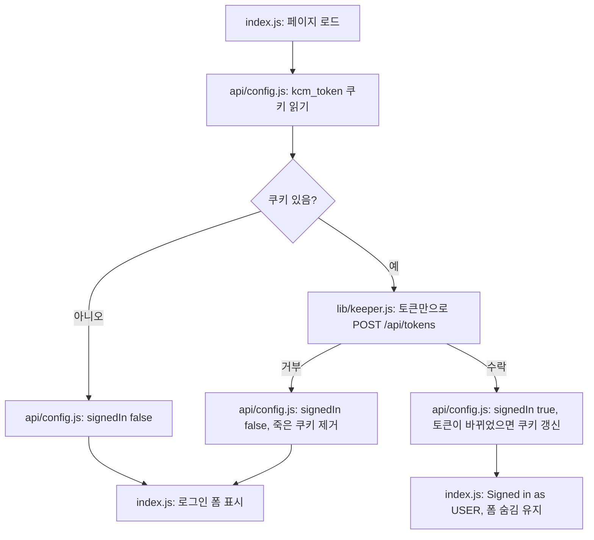

# 기존 Keeper 세션 감지 — 구현 계획서

**상태:** 2026-09-09 제안. 범위가 작은 변경이라 계획 깊이도 그에 맞춘다.

**목표:** 유효한 세션이 이미 있는데 Keeper 비밀번호를 다시 묻지 않게 한다. 페이지를 열면 기존
토큰을 인식해 "Signed in as ..."를 보여주고, 로그인 폼은 정말로 세션이 없을 때만 남긴다.

**아키텍처:** 새 라우트를 만들지 않는다. `/api/config`는 이미 마운트 시 호출되고 이미
`keeperUsername`을 담고 있으므로, 여기서 쿠키 토큰을 검증해 결과를 함께 돌려준다. 토큰만으로
재인증하는 라이브러리 함수 하나를 추가한다.

**기술 스택:** 기존 Next.js API 라우트, `axios`, 이미 쓰고 있는 `kcm_token` 쿠키.

---

## 배경

Keeper 토큰은 HttpOnly `kcm_token` 쿠키에 있고 `loadAuthFromRequest()`가 매 요청마다 읽으므로,
**세션 자체는 dev 서버를 재시작해도 살아 있다.** 살아남지 못하는 것은 UI의 인식이다.
`isAuthenticated`가 React 로컬 상태라서 새로고침하면 "Provide credentials"로 돌아가고, 멀쩡한
세션인데도 비밀번호를 다시 입력하게 된다.

작성 전에 두 가지를 확인했다.

| 확인 항목 | 결과 |
|---|---|
| 인스턴스의 `/api/ext/saml/callback`, `/api/ext/openid/callback` | 404 — SSO 확장이 꺼져 있어 DemoHub 같은 SSO 로그인은 불가능 |
| Guacamole `POST /api/tokens`에 `token=<기존 토큰>`만 전송 | 재인증을 지원한다고 문서화됨. `authToken`, `username`, `dataSource`를 돌려주고 세션 활동 시간을 갱신 |

두 번째 사실 덕분에 비밀번호를 저장하지 않고도 해결된다.

## 하지 않을 것

- Keeper 비밀번호를 어디에도 저장하지 않는다. 범위가 정해진 발급물이 아니라 사람의 계정
  비밀번호이므로 토큰만 다룬다.
- Keeper용 SSO. KCM 서버에서 켜야 하는 것이고 우리 소관이 아니다.
- 로그인 폼 자체, 로그아웃 흐름, 다른 라우트의 인증 처리에는 손대지 않는다.

---

## 동작 흐름

---

## 변경 대상

| 파일 | 변경 내용 |
|---|---|
| `web/lib/keeper.js` | `reauthenticateToKeeper(token, apiUrl)` 추가. `token`만 담아 `POST /api/tokens`를 호출하고 `{ authToken, username }`을 반환하거나 예외 발생 |
| `web/pages/api/config.js` | 쿠키를 읽어 재인증하고 응답에 `signedIn` 포함. Guacamole이 다른 토큰을 주면 `kcm_token` 재발급, 거부되면 쿠키 정리 |
| `web/pages/index.js` | config 응답의 `signedIn`으로 `isAuthenticated` 설정 |
| `web/scripts/check-keeper-session.js` (신규) | 실제 세션 없이 검증 가능한 부분에 대한 오프라인 체크 |

Guacamole은 재인증 시 **새 토큰을 줄 수도 있다.** 따라서 응답을 기준으로 삼고 값이 다르면 쿠키를
다시 쓴다. 실패는 치명적으로 다루지 않는다. 설정값은 그대로 돌려주어 페이지는 정상 렌더링되고
`signedIn`만 false가 된다.

## 검증

**2단계 — 읽기 전용 실측.** 잘못된 토큰으로 `POST /api/tokens`를 보냈을 때 수락되거나 이상하게
실패하지 않고 제대로 거부되는지 확인한다. 인스턴스가 이 파라미터를 이해한다는 증거다. 인증된
쪽 절반은 에이전트에게 Keeper 비밀번호가 없어 여기서 수행할 수 없으므로 사용자가 확인한다.

**3단계 — 드라이런, 사용자 수행.** 한 번 로그인한 뒤 새로고침하면 비밀번호 요구 없이 "Signed in
as ..."가 유지되어야 한다. dev 서버를 재시작하고 새로고침해도 동일해야 한다. 그다음 Logout 후
새로고침하면 로그인 폼이 다시 나와야 한다.

**실행 가능한 체크.** `web/scripts/check-keeper-session.js`, 오프라인으로 동작한다. 쿠키 파싱이
토큰을 제대로 꺼내는지, 쿠키가 없을 때 토큰이 없다고 판단하는지, 그리고 재인증 결과를
`{signedIn, setCookie}`로 바꾸는 판단 헬퍼가 세 경우(같은 토큰, 회전된 토큰, 거부)에서 올바른지
검사한다.

## 위험 요소

이 Guacamole 빌드가 토큰만의 재인증을 지원하지 않으면 모든 검사가 단순히 `signedIn: false`를
반환하고 앱은 지금과 똑같이 동작한다. 실패했을 때의 모습이 곧 현재 동작이다.

만료된 세션은 여전히 비밀번호를 한 번 요구한다. 의도한 동작이다.
