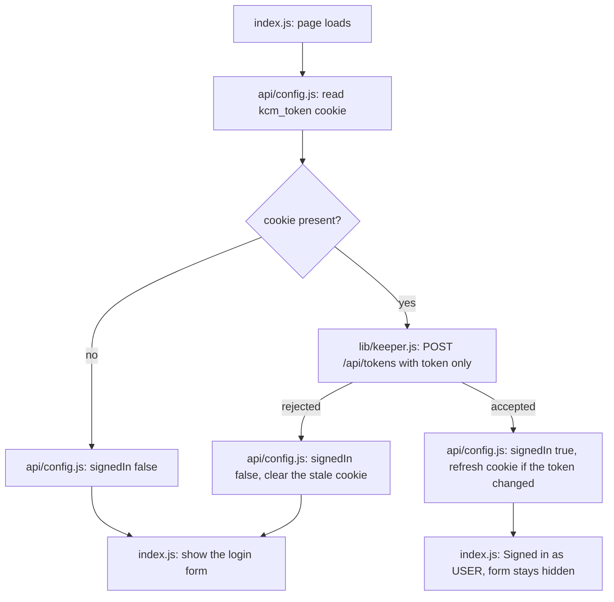

# Detect an Existing Keeper Session — Implementation Plan

**Status:** Proposed 2026-09-09. Small, scoped change; planning depth kept proportional.

**Goal:** Stop asking for the Keeper password when a valid session is already there. On page
load the app should recognise the existing token, show "Signed in as ...", and leave the
login form for the case where there genuinely is no session.

**Architecture:** No new route. `/api/config` is already fetched on mount and already carries
`keeperUsername`, so it also validates the cookie token and reports whether it worked. One
new library function performs the token-only re-authentication.

**Tech Stack:** Existing Next.js API routes, `axios`, the `kcm_token` cookie already in use.

---

## Background

The Keeper token lives in an HttpOnly `kcm_token` cookie and `loadAuthFromRequest()` reads it
on every request, so the session already survives a dev-server restart. What does not survive
is the UI's knowledge of it: `isAuthenticated` is local React state, so a refresh drops back
to "Provide credentials" and the password gets typed again for a session that is still valid.

Two things were established before writing this:

| Check | Result |
|---|---|
| `/api/ext/saml/callback`, `/api/ext/openid/callback` on the instance | 404 — no SSO extension is enabled, so an SSO sign-in like DemoHub's is not available |
| Guacamole `POST /api/tokens` with only `token=<existing>` | Documented to re-authenticate: returns `authToken`, `username`, `dataSource`, and refreshes session activity |

The second is what makes this possible without storing a password.

## Non-goals

- Storing the Keeper password anywhere. It is a human account password, not a scoped grant;
  only tokens are handled.
- SSO for Keeper. It would have to be enabled on the KCM server, which is not ours.
- Touching the login form itself, the logout flow, or any other route's auth handling.

---

## Operator flow

---

## Proposed changes

| File | Change |
|---|---|
| `web/lib/keeper.js` | Add `reauthenticateToKeeper(token, apiUrl)`: `POST /api/tokens` with `token` only, returning `{ authToken, username }` or throwing |
| `web/pages/api/config.js` | Read the cookie, re-authenticate, include `signedIn` in the response, re-issue `kcm_token` if Guacamole returned a different one, clear cookies when it is rejected |
| `web/pages/index.js` | Use `signedIn` from the config response to set `isAuthenticated` |
| `web/scripts/check-keeper-session.js` (new) | Offline check for the parts that can be tested without a live session |

Guacamole may return a *new* token from a re-authentication, so the response is treated as
authoritative and the cookie is rewritten when it differs. Failure is never fatal: the config
values still come back so the page renders, just with `signedIn: false`.

## Verification

**Stage 2 — read-only live.** `POST /api/tokens` with a bogus token must be rejected rather
than accepted or erroring oddly; this confirms the parameter is understood by the instance.
The authenticated half cannot be exercised from here because the Keeper password is not
available to the agent — the user performs it.

**Stage 3 — dry-run, performed by the user.** Log in once, refresh the page: the pill should
stay "Signed in as ..." with no password prompt. Restart the dev server and refresh: same
result. Then `Logout` and refresh: the login form must come back.

**Runnable check.** `web/scripts/check-keeper-session.js`, offline: cookie parsing returns the
token, a missing cookie yields no token, and the decision helper that turns a
re-authentication result into `{signedIn, setCookie}` behaves for three cases — same token,
rotated token, rejection.

## Risks

If this Guacamole build does not honour token-only re-authentication, every check simply
reports `signedIn: false` and the app behaves exactly as it does today. The failure mode is
the current behaviour, not a broken app.

An expired session still requires the password once. That is intentional.
